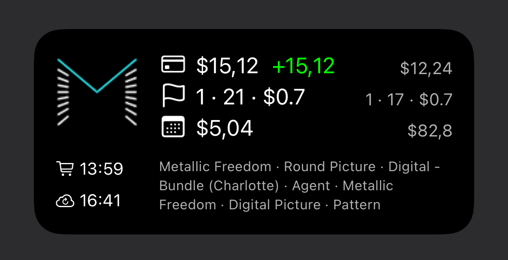

# scriptable-kpay-widget
Kiezelpay widget for Scriptable app.

This is a widget for Scriptable app (https://scriptable.app) to show your Kiezelpay (https://kiezelpay.co) statistics. The code is heavely based on kStats (https://github.com/john-reno/kStats).

To run the widget copy "Kpay Widget" folder and "Kpay Widget.js" in your "Scriptable" folder on your iCloud.
Replace the test Kpay API Key with your personal API Key in "Kpay Widget.js".
Perplace "Kpay Widget/data/logo.png" with your own logo.
Add a medium widget to your homescreen.
